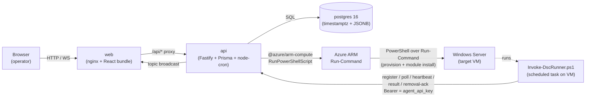
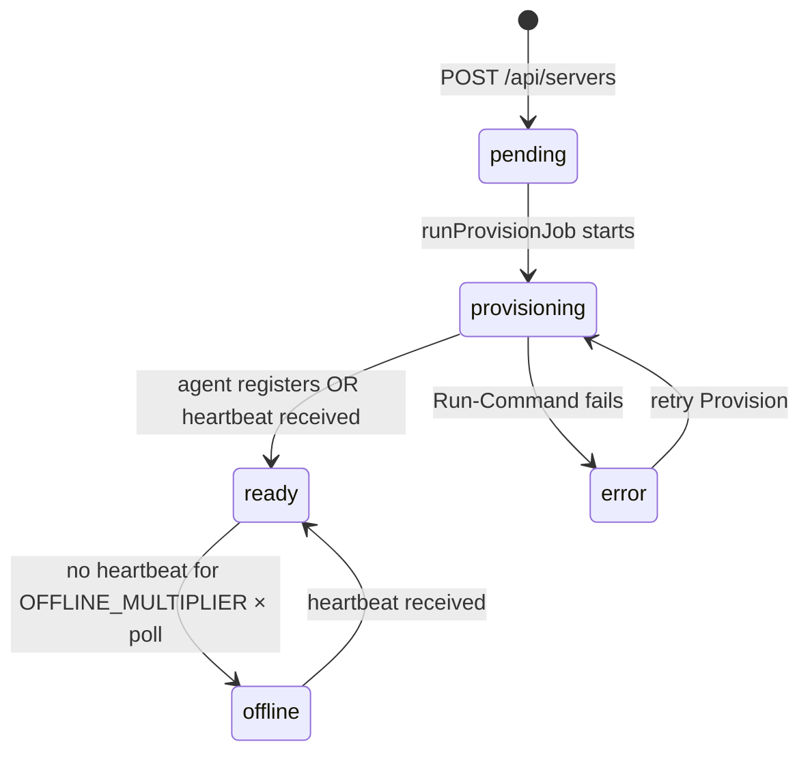
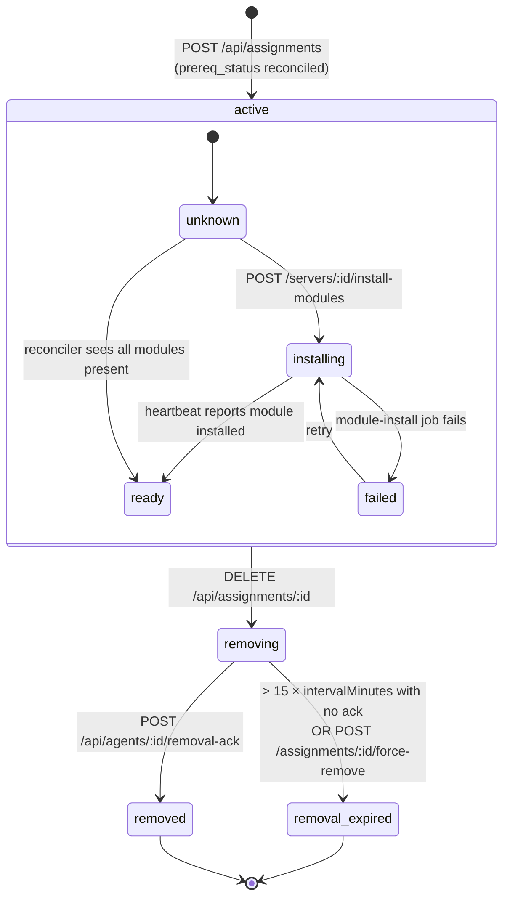

# Architecture

## One-page picture



The browser only ever talks to the `web` container, which proxies `/api/*`
and `/ws` to the `api` container (see `apps/web/nginx.conf`). The `api`
container is the only process with database, Azure, and WebSocket
responsibility.

## Components

| Component | Source | Responsibility |
| --- | --- | --- |
| **web** | [`apps/web`](../apps/web) | React 18 + Vite + Tailwind + shadcn/ui + Monaco. Built into static assets and served by nginx. Proxies `/api/*` and `/ws` to the api over the docker / k8s network. |
| **api** | [`apps/api`](../apps/api) | Fastify 5 + Prisma 6 + zod. Single replica. Hosts UI-facing CRUD, agent wire protocol, scheduler loop, job runners, and the WebSocket bridge. |
| **postgres** | bundled `postgres:16-alpine` (compose) or `StatefulSet` (k8s) | Source of truth for everything. All times `timestamptz`; large blobs (config YAML, `dsc` output, audit payloads) stored as `text` / `JSONB`. |
| **scheduler-loop** | [`apps/api/src/services/scheduler.ts`](../apps/api/src/services/scheduler.ts) | `node-cron` every 30s. Marks servers offline, expires stale removals, backfills `next_due_at`, reconciles `prereq_status`, and re-fires stuck queued jobs. |
| **job-runners** | [`apps/api/src/services/jobs.ts`](../apps/api/src/services/jobs.ts) | In-process runners for `provision` and `module_install` jobs. Both invoke Azure Run-Command via [`apps/api/src/services/azureCompute.ts`](../apps/api/src/services/azureCompute.ts). |
| **agent-bridge** | [`anwather/dsc-fleet`](https://github.com/anwather/dsc-fleet) — `Register-DashboardAgent.ps1` + `Invoke-DscRunner.ps1 -Mode Dashboard` | Lives in the companion repo so the v1 (Phase 1) Git-pull mode and v2 (Dashboard) mode share one PowerShell codebase. The dashboard repo never vendors a copy. |

## Data model

The canonical schema is [`apps/api/prisma/schema.prisma`](../apps/api/prisma/schema.prisma).
The entities at a glance:

| Entity | Notes |
| --- | --- |
| `servers` | Azure VM identity (sub + RG + name, unique together) plus discovered metadata. `status` enum: `pending / provisioning / ready / error / offline`. |
| `agent_keys` | SHA-256 hashes of agent API keys. Multiple non-revoked rows per server are allowed for zero-downtime rotation. |
| `server_modules` | Normalised projection of installed PowerShell modules per server. Updated from agent heartbeat payloads. |
| `configs` | Logical name; `current_revision_id` points at the latest. Soft-deleted via `deleted_at`. |
| `config_revisions` | **Immutable**. Holds `yaml_body`, `source_sha256`, `semantic_sha256`, `required_modules`, `parsed_resources`, and `version`. Never updated. |
| `assignments` | `(server, config)` mapping with `interval_minutes`, `generation`, `lifecycle_state`, `prereq_status`. Partial-unique on active+removing rows (see below). |
| `jobs` | Async work — `provision` and `module_install`. Stream stdout/stderr into `log`. Statuses: `queued / running / success / failed / cancelled`. |
| `run_results` | One row per agent-side `dsc config set` invocation. Idempotent on `run_id`. |
| `audit_events` | Append-only log. Every UI mutation, agent action, and system transition writes here. |
| `settings` | Key-value JSONB for runtime tunables (currently empty in v1). |

For the canonical types, fields, and indexes, **read the Prisma schema**.
The shapes returned over the wire are documented inline in the route handlers
under `apps/api/src/routes/`.

## Why each architectural choice

### Single api replica = singleton scheduler

[`scheduler.ts`](../apps/api/src/services/scheduler.ts) holds in-process state
(the `cron.ScheduledTask` handle) and assumes single-writer access to the
`assignments` and `jobs` tables for offline-detection / removal-expiry /
prereq-reconciliation. Running two replicas would race on `next_due_at` and
double-fire jobs. Both `docker-compose.yml` and `k8s/21-api.yaml` deploy a
single replica; horizontal scaling requires leader election and is out of
scope for v1.

### Immutable config revisions

[`POST /api/configs`](../apps/api/src/routes/configs.ts) and `PATCH /api/configs/:id`
always insert a new `config_revisions` row when the YAML changes; the existing
row is never mutated. This gives:

- A complete audit trail of what was on the wire at any point.
- The ability for `run_results` to reference the **exact** revision that was
  applied (`config_revision_id`), even if the user has since edited the
  config 20 more times.
- Replay-by-revision: a future force-apply can target any historical revision.

### Dual hashes (`source_sha256` + `semantic_sha256`)

`source_sha256` is the SHA-256 of the literal UTF-8 bytes the user submitted
— that's what the agent compares to detect "the body I have is the body the
server has". `semantic_sha256` is the SHA-256 of canonical JSON (sorted
object keys at every level) — used by `PATCH /api/configs/:id` to suppress
no-op revisions when only whitespace or comments changed. Both are computed
in [`yamlParser.ts`](../apps/api/src/services/yamlParser.ts).

### Partial unique on assignments

```sql
CREATE UNIQUE INDEX uniq_active_assignment
  ON assignments(server_id, config_id)
  WHERE lifecycle_state IN ('active','removing');
```

(See `apps/api/prisma/migrations/20260427085300_assignment_partial_unique/`.)
This lets you re-assign the same config to the same server **after** a
previous assignment was removed, without colliding with the historical row.
On reassignment, [`assignments.ts`](../apps/api/src/routes/assignments.ts)
sets `generation = max(prior generation) + 1`, which the agent echoes on every
result so stale agents (still trying to apply the previous incarnation) are
rejected with `409 GenerationMismatch`.

### ETag / 304 polling

[`GET /api/agents/:agentId/assignments?since=`](../apps/api/src/routes/agents.ts)
computes a stable ETag over the deterministic essence of the response
(`assignmentId, generation, revisionId, sourceSha256, intervalMinutes,
lifecycleState, prereqStatus, nextDueAt`). When the agent's `If-None-Match`
header (or `?since=` query param) matches, the api returns `304 Not Modified`
with no body — at 60s polling that's roughly 1440 cheap pings per agent per
day instead of 1440 full payloads.

### Generation guard against stale agent results

[`POST /api/agents/:agentId/results`](../apps/api/src/routes/agents.ts)
rejects any result whose `generation` field doesn't match
`assignments.generation`. This protects against:

- An agent that started a long DSC run, then the operator removed the
  assignment, then the operator re-assigned it with new parameters — the old
  agent's result would otherwise overwrite `last_status` for the new
  generation. Now it gets a `409` and is dropped.
- A `runId` collision across re-assignments — `runId` is also enforced as
  the idempotency key (same `runId` returns the existing row with
  `idempotent: true`).

### Provision token vs long-lived agent key

A **provision token** is short-lived (defaults to
`AZURE_RUNCOMMAND_TIMEOUT_MINUTES` minutes), single-use, and only ever
travels in two places: inside the Run-Command script the api injects, and on
the wire of `POST /api/agents/register` (see
[`agents.ts:register`](../apps/api/src/routes/agents.ts)). It cannot read or
write anything else.

A **long-lived agent API key** is what `register` returns the first (and
only) time. It is sent as `Authorization: Bearer <key>` on every subsequent
agent endpoint. Hashed at rest with SHA-256 in `agent_keys.key_hash`
(see [`agentAuth.ts`](../apps/api/src/lib/agentAuth.ts) and
[`tokens.ts`](../apps/api/src/lib/tokens.ts)). Multiple non-revoked rows per
server are allowed so rotation can issue a new key, deploy it to the agent,
and revoke the old one without a downtime window.

## Lifecycle state machines

### Server



Source: `status` updates in [`servers.ts`](../apps/api/src/routes/servers.ts),
[`agents.ts:register`](../apps/api/src/routes/agents.ts) (sets `ready`),
[`agents.ts:heartbeat`](../apps/api/src/routes/agents.ts) (revives `offline`),
[`scheduler.ts:markOffline`](../apps/api/src/services/scheduler.ts), and
[`jobs.ts:runProvisionJob`](../apps/api/src/services/jobs.ts).

### Assignment



The inner `prereq_status` sub-states live on the assignment alongside
`lifecycle_state`. The agent silently skips any assignment whose
`prereq_status` is not `ready`, so the operator (or the auto-install path)
has to drive prereqs to `ready` before the config will ever apply.

Source: [`assignments.ts`](../apps/api/src/routes/assignments.ts) for active
→ removing transitions, [`agents.ts:removal-ack`](../apps/api/src/routes/agents.ts)
for the agent-driven completion, and
[`scheduler.ts:expireStaleRemovals`](../apps/api/src/services/scheduler.ts)
for the timeout sweep.

## Agent poll loop

For completeness — the wire protocol implemented by both sides:

1. `GET /api/agents/:agentId/assignments?since=<etag>` →
   `304` or `{ etag, serverTime, pollIntervalSeconds, assignments: [...] }`.
2. For each assignment with `lifecycle_state = 'active'`,
   `prereq_status = 'ready'`, and `now >= next_due_at`:
   - `GET /api/agents/:agentId/revisions/:revisionId` →
     `{ revisionId, configId, version, yamlBody, sourceSha256, requiredModules }`.
   - Run `dsc config set --document <tmp.yaml> --output-format json`.
   - `POST /api/agents/:agentId/results` with
     `{ assignmentId, generation, runId, revisionId, exitCode, hadErrors,
        inDesiredState, durationMs, startedAt, finishedAt, dscOutput }`.
3. For each assignment with `lifecycle_state = 'removing'`: best-effort run
   any uninstall semantics, then `POST /api/agents/:agentId/removal-ack`.
4. `POST /api/agents/:agentId/heartbeat` with
   `{ osCaption, osVersion, dscExeVersion, agentVersion, modules: [{name, version}], serverTime }`.

The scheduler watches for hearts to stop and flips `status` to `offline`
when `last_heartbeat_at < now - OFFLINE_MULTIPLIER × AGENT_POLL_DEFAULT_SECONDS`.

## WebSocket

`/ws` is a topic-based broadcaster, **not** the source of truth — it exists
purely to give the UI live updates without polling. Clients send
`{"action":"subscribe","topic":"server:<id>"}` (or `job:<id>`) frames; the api
side calls `app.broadcast(topic, type, payload)` from any handler. On
disconnect / reconnect the UI re-fetches the relevant React Query keys, so
no event delivery is required for correctness. Implementation:
[`apps/api/src/plugins/websocket.ts`](../apps/api/src/plugins/websocket.ts).
