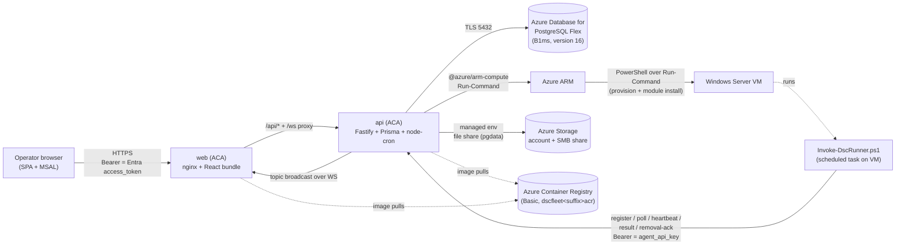
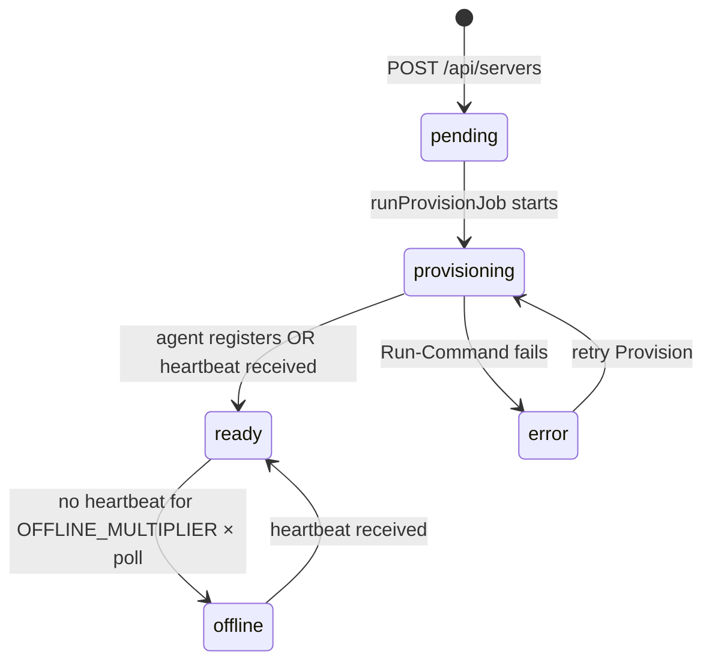
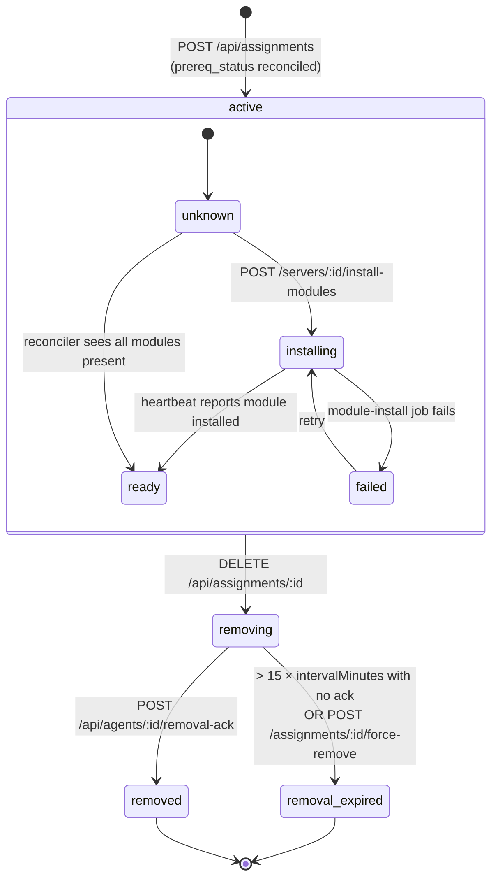

# Architecture

dsc-fleet-dashboard is a control plane for applying [Microsoft DSC v3](https://learn.microsoft.com/powershell/dsc/overview) configurations to a fleet of Windows Server VMs in Azure. The dashboard is the system of record; agents on each VM poll for work and report results back.

## High-level component diagram



Textual summary of the edges:

- **Web ↔ API**: nginx in the `web` container proxies `/api/*` and `/ws` to the `api` container over the ACA internal network. Browsers never hit the API origin directly.
- **API ↔ Postgres**: TLS to Azure Database for PostgreSQL Flexible Server.
- **API ↔ Storage**: the ACA environment mounts an Azure Files SMB share named `pgdata` as managed env storage. Provisioned by the Bicep but unused on the managed Postgres path; reserved for an optional in-environment Postgres alternative that is not part of the supported deployment.
- **API ↔ ACR**: image pulls only — no runtime API calls. UAMI has `AcrPull` on the registry.
- **API ↔ Azure ARM**: `@azure/arm-compute` `RunPowerShellScript` calls against VMs in the lab RG (`dsc-v3` by default). UAMI has Virtual Machine Contributor cross-RG.
- **Web ↔ API ↔ Agents**: the only agent-reachable surface is `/api/agents/*` over HTTPS, authenticated with a per-server bearer key.
- **Agents ↔ Windows Servers**: the agent runs as a scheduled task on the VM and invokes `dsc config set` locally — no remote PowerShell, no SMB.

## Components

| Component | Source | Responsibility |
| --- | --- | --- |
| **web** | [`apps/web`](../apps/web) | React 18 + Vite + Tailwind + shadcn/ui + Monaco. Built into static assets and served by nginx. Proxies `/api/*` and `/ws` to the api over the ACA / docker network. MSAL handles sign-in; `<AuthGate>` blocks render until there is a signed-in account. |
| **api** | [`apps/api`](../apps/api) | Fastify 5 + Prisma 6 + zod. Single replica. Hosts UI-facing CRUD, agent wire protocol, scheduler loop, in-process job runners, and the WebSocket bridge. Validates Entra JWTs via `jose` + JWKS. |
| **postgres** | Azure Database for PostgreSQL Flexible Server (B1ms, version 16). Source of truth for everything | All times `timestamptz`; large blobs (config YAML, `dsc` output, audit payloads) stored as `text` / `JSONB`. |
| **storage account** | Azure Storage + SMB file share `pgdata` (100 GiB) | Managed env storage in the ACA environment; only used by the optional in-env Postgres container. |
| **container registry** | ACR Basic, `dscfleet<suffix>acr` | Holds `dsc-fleet/api:<tag>` and `dsc-fleet/web:<tag>`. UAMI has `AcrPull`. |
| **scheduler-loop** | [`apps/api/src/services/scheduler.ts`](../apps/api/src/services/scheduler.ts) | `node-cron` every 30s. Marks servers offline, expires stale removals, backfills `next_due_at`, reconciles `prereq_status`, re-fires stuck queued jobs, and scrubs consumed / expired `agent_credentials` rows. |
| **job-runners** | [`apps/api/src/services/jobs.ts`](../apps/api/src/services/jobs.ts) | In-process runners for `provision` and `module_install` jobs. Both invoke Azure Run-Command via [`apps/api/src/services/azureCompute.ts`](../apps/api/src/services/azureCompute.ts). |
| **websocket bridge** | [`apps/api/src/plugins/websocket.ts`](../apps/api/src/plugins/websocket.ts) | Topic-based broadcast over `/ws`. Auth via `?access_token=` (Entra). Used by the UI for live server status, job progress, run-completed events, and the run-output drawer. |
| **agent** | [`anwather/dsc-fleet`](https://github.com/anwather/dsc-fleet) — `Register-DashboardAgent.ps1` + `Invoke-DscRunner.ps1 -Mode Dashboard` | Lives in the companion repo so the v1 (Phase 1) Git-pull mode and v2 (Dashboard) mode share one PowerShell codebase. The dashboard repo never vendors a copy. |

## Authentication

Two completely separate auth pipelines share the same Fastify process.

| Caller | Surface | Mechanism | Source |
| --- | --- | --- | --- |
| Operator browser | `/api/{servers,configs,assignments,jobs,run-results,audit-events}/**`, `/ws` | Entra ID OAuth 2.0 access token. SPA acquires via MSAL (`api://<clientId>/access_as_user`); API validates `iss`/`aud`/`tid`/`scp` against JWKS | `apps/api/src/lib/entraAuth.ts`, `apps/api/src/plugins/entraAuth.ts`, `apps/web/src/lib/{authConfig,authToken,msal}.ts` |
| Agent (Windows VM) | `/api/agents/**` | Long-lived per-server bearer key. SHA-256-hashed at rest in `agent_keys.key_hash`. Multiple non-revoked rows per server allowed for rotation | `apps/api/src/lib/agentAuth.ts`, `apps/api/src/lib/tokens.ts` |
| Agent bootstrap (one-time) | `/api/agents/runas/:urlToken` | URL-path token + `Bearer <provisionToken>`. Single-use; row marked `consumed_at` atomically | `apps/api/src/routes/agents.ts` |
| Anonymous | `/healthz` | Open by design — ACA / k8s probe target | `apps/api/src/routes/health.ts` |

Full Entra setup, scope shapes, and teardown procedure: [`docs/entra-setup.md`](./entra-setup.md).

## Data plane

The canonical schema is [`apps/api/prisma/schema.prisma`](../apps/api/prisma/schema.prisma); the per-table walk-through with relationships, indexes, and the ER diagram is in [`docs/data-model.md`](./data-model.md). One-line summary:

| Entity | Notes |
| --- | --- |
| `servers` | Azure VM identity (sub + RG + name, partial-unique on non-deleted rows) plus discovered metadata. `status`: `pending / provisioning / ready / error / offline`. Holds the persistent encrypted run-as block. |
| `agent_keys` | SHA-256 hashes of agent API keys. |
| `agent_credentials` | One-time encrypted run-as drop for the bootstrap script. |
| `server_modules` | Normalised projection of installed PowerShell modules per server. |
| `configs` / `config_revisions` | Logical config + immutable revision history. Dual hash (`source_sha256` + `semantic_sha256`). |
| `assignments` | `(server, config)` mapping with `interval_minutes`, `generation`, `lifecycle_state`, `prereq_status`. Partial-unique on active+removing rows. |
| `jobs` | Async work — `provision`, `prereq-install`, `module-install`, `config-apply`, `uninstall-config`. |
| `run_results` | One row per agent-side `dsc config set`. Idempotent on `run_id`. |
| `audit_events` | Append-only log. Loose entity ref so events survive deletion. |
| `settings` | Reserved for runtime tunables. |

## UI surface (web app)

| Surface | Source | Notes |
| --- | --- | --- |
| Sign-in gate | `apps/web/src/components/auth/AuthGate.tsx` | Triggers `loginRedirect` when there is no MSAL account; renders the app once a token is in cache. |
| Monaco YAML editor | `apps/web/src/components/MonacoYamlEditor.tsx` | Embedded for config authoring. **Format-on-validate** is wired in: when the API accepts the YAML and emits a new `config_revision`, the editor reformats the buffer to the canonical `yaml_body`, so what the user sees matches what the agents will run. |
| Run-output drawer | Per-run side panel | Slides in when a row in the run-results table is clicked. Shows the structured `dsc_output` JSON from the latest `RunResult`, plus exit code, drift / desired-state booleans, and timing. Live updates via WS subscription on `server:<id>` so an in-flight run streams in without polling. |
| Live updates | `useWebSocket` hook | Connects to `/ws?access_token=<jwt>`, subscribes to topic frames (`server:<id>`, `job:<id>`); on disconnect the UI re-fetches the relevant React Query keys, so event delivery is best-effort. |

## Why each architectural choice

### Single api replica = singleton scheduler

[`scheduler.ts`](../apps/api/src/services/scheduler.ts) holds in-process state (the `cron.ScheduledTask` handle) and assumes single-writer access to the `assignments` and `jobs` tables for offline-detection / removal-expiry / prereq-reconciliation. Running two replicas would race on `next_due_at` and double-fire jobs. The ACA `apps` module deploys a single replica; horizontal scaling requires leader election and is out of scope for v1.

### Immutable config revisions

`POST /api/configs` and `PATCH /api/configs/:id` always insert a new `config_revisions` row when the YAML changes; the existing row is never mutated. This gives:

- A complete audit trail of what was on the wire at any point.
- The ability for `run_results` to reference the **exact** revision that was applied (`config_revision_id`).
- Replay-by-revision for any historical revision.

### Dual hashes (`source_sha256` + `semantic_sha256`)

`source_sha256` is the SHA-256 of the literal UTF-8 bytes the user submitted — that's what the agent compares to detect "the body I have is the body the server has". `semantic_sha256` is the SHA-256 of canonical JSON (sorted object keys at every level) — used by `PATCH /api/configs/:id` to suppress no-op revisions when only whitespace or comments changed. Both are computed in [`yamlParser.ts`](../apps/api/src/services/yamlParser.ts).

### Partial unique on assignments

```sql
CREATE UNIQUE INDEX uniq_active_assignment
  ON assignments(server_id, config_id)
  WHERE lifecycle_state IN ('active','removing');
```

(See `apps/api/prisma/migrations/20260427085300_assignment_partial_unique/`.) Lets you re-assign the same config to the same server **after** a previous assignment was removed without colliding with the historical row. On reassignment, [`assignments.ts`](../apps/api/src/routes/assignments.ts) sets `generation = max(prior generation) + 1`, which the agent echoes on every result so stale agents are rejected with `409 GenerationMismatch`.

### ETag / 304 polling

`GET /api/agents/:agentId/assignments?since=` computes a stable ETag over the deterministic essence of the response (`assignmentId, generation, revisionId, sourceSha256, intervalMinutes, lifecycleState, prereqStatus, nextDueAt`). When the agent's `If-None-Match` header (or `?since=` query param) matches, the api returns `304 Not Modified` with no body — at 60s polling that's roughly 1440 cheap pings per agent per day instead of 1440 full payloads.

### Generation guard against stale agent results

`POST /api/agents/:agentId/results` rejects any result whose `generation` field doesn't match `assignments.generation`. This protects against:

- An agent that started a long DSC run, then the operator removed and re-assigned it — the old agent's result would otherwise overwrite `last_status` for the new generation.
- A `runId` collision across re-assignments — `runId` is also enforced as the idempotency key (same `runId` returns the existing row with `idempotent: true`).

### Provision token vs long-lived agent key

A **provision token** is short-lived (defaults to `AZURE_RUNCOMMAND_TIMEOUT_MINUTES` minutes), single-use, and only ever travels in two places: inside the Run-Command script the api injects, and on the wire of `POST /api/agents/register`. It cannot read or write anything else.

A **long-lived agent API key** is what `register` returns the first (and only) time. It is sent as `Authorization: Bearer <key>` on every subsequent agent endpoint. Hashed at rest with SHA-256 in `agent_keys.key_hash` (see [`agentAuth.ts`](../apps/api/src/lib/agentAuth.ts) and [`tokens.ts`](../apps/api/src/lib/tokens.ts)). Multiple non-revoked rows per server are allowed so rotation can issue a new key, deploy it to the agent, and revoke the old one without a downtime window.

### Encrypted run-as credentials

Plaintext run-as passwords never leave the API process unencrypted. AES-256-GCM (master key `RUNAS_MASTER_KEY`, 32 bytes base64) seals both the persistent block on `servers.run_as_*` and the one-time `agent_credentials` drop. `gmsa` and `system` rows store empty bytea — the kind/user fields carry the meaning. See [`docs/data-model.md`](./data-model.md#run-as-credential-storage) for the full flow and [`apps/api/src/lib/runasCrypto.ts`](../apps/api/src/lib/runasCrypto.ts).

## Lifecycle state machines

### Server



### Assignment



The agent silently skips any assignment whose `prereq_status` is not `ready`, so the operator (or the auto-install path) has to drive prereqs to `ready` before the config will ever apply.

## Agent wire protocol

For completeness — the wire protocol implemented by both sides:

1. `GET /api/agents/:agentId/assignments?since=<etag>` → `304` or `{ etag, serverTime, pollIntervalSeconds, assignments: [...] }`.
2. For each assignment with `lifecycle_state = 'active'`, `prereq_status = 'ready'`, and `now >= next_due_at`:
   - `GET /api/agents/:agentId/revisions/:revisionId` → `{ revisionId, configId, version, yamlBody, sourceSha256, requiredModules }`.
   - Run `dsc config set --document <tmp.yaml> --output-format json`.
   - `POST /api/agents/:agentId/results` with `{ assignmentId, generation, runId, revisionId, exitCode, hadErrors, inDesiredState, durationMs, startedAt, finishedAt, dscOutput }`.
3. For each assignment with `lifecycle_state = 'removing'`: best-effort run any uninstall semantics, then `POST /api/agents/:agentId/removal-ack`.
4. `POST /api/agents/:agentId/heartbeat` with `{ osCaption, osVersion, dscExeVersion, agentVersion, modules: [{name, version}], serverTime }`.

The scheduler watches for hearts to stop and flips `status` to `offline` when `last_heartbeat_at < now - OFFLINE_MULTIPLIER × AGENT_POLL_DEFAULT_SECONDS`.

## Container images

Both images are built and pushed by [`azure/scripts/build-and-push.ps1`](../azure/scripts/build-and-push.ps1) into the ACR `dscfleet<suffix>acr.azurecr.io`:

| Image | Repository | Built from |
| --- | --- | --- |
| API | `dsc-fleet/api` | `apps/api/Dockerfile` (Node 20, Fastify) |
| Web | `dsc-fleet/web` | `apps/web/Dockerfile` (multi-stage Vite build → nginx). Vite env vars `VITE_ENTRA_TENANT_ID` and `VITE_ENTRA_CLIENT_ID` are baked at build time as `--build-arg`. |

### "Latest deployed" semantics

ACA does **not** auto-pull on `:latest`. The actual revision running for each app is whatever the last `az containerapp update` pinned — usually a digest reference produced by [`azure/scripts/deploy-apps.ps1`](../azure/scripts/deploy-apps.ps1).

To inspect what is *currently* deployed:

```powershell
$rg = 'dsc-fleet-dashboard'

# Image (digest or tag) currently pinned on the active revision
az containerapp show -g $rg -n api `
  --query 'properties.template.containers[0].image' -o tsv
az containerapp show -g $rg -n web `
  --query 'properties.template.containers[0].image' -o tsv

# Active revision name + traffic split (for blue/green confirmation)
az containerapp revision list -g $rg -n api -o table
```

To roll forward to a freshly pushed tag, pin to its digest so ACA actually
creates a new revision:

```powershell
$acr = 'dscfleetdscacr'
$d = az acr repository show --name $acr --image 'dsc-fleet/api:<tag>' `
       --query digest -o tsv
az containerapp update -g $rg -n api --image "$acr.azurecr.io/dsc-fleet/api@$d"
```

There is no "global latest deployed SHA" pin tracked in this repo — `:latest`
in the Bicep template (`imageTag` parameter, default `latest`) is only used
on the very first `deployApps=true` deployment. After that, treat the
digest reported by `az containerapp show` as the source of truth for what is
running.

## What is *not* protected

- `/healthz` — ACA liveness/readiness probe target.
- `/api/agents/*` and `/api/agents/runas/:urlToken` — agents authenticate with their own per-server bearer key (or one-time provision token for the runas drop). Entra is never in this path.
